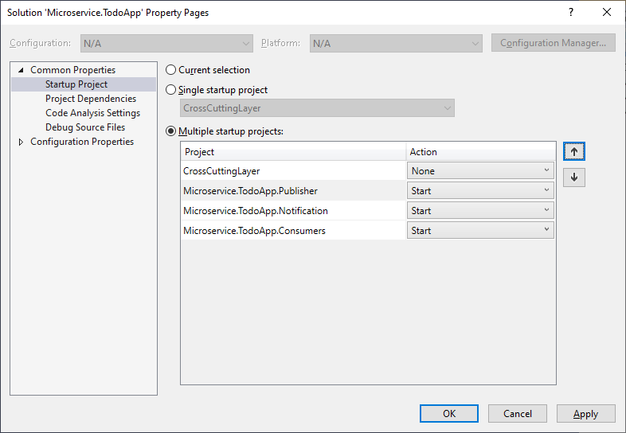
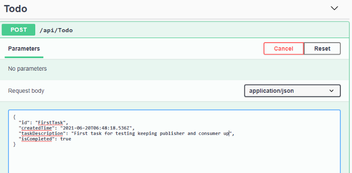
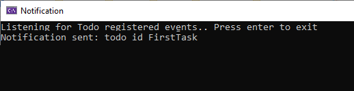

# RabbitMQ--Microservice-Communication-with-MassTransit

Read the Entire Article here- https://amit-naik.medium.com/rabbitmq-with-asp-net-core-microservice-communication-with-masstransit-2314bc477736

## Install ErLang and RabbitMQ in your local machine

* ErLang
* RabbitMQ

```ps1
cd C:\Program Files\RabbitMQ Server\rabbitmq_server-3.8.17\sbin
rabbitmq-plugins enable rabbitmq_management
net stop RabbitMQ
net start RabbitMQ
```

## Steps to run application

### Step 1:

Keeping Publisher and Consumer/Notification running as Multiple startup projects



### Step 2: Call post method



Output


